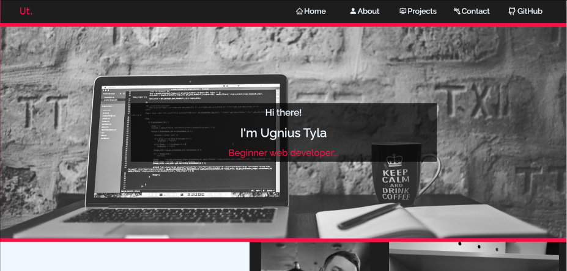

<h2 align="center">
  Portfolio Website - v2.0 
  <a href="/" target="_blank">Ugnius Tyla</a>
</h2>

  

## Built With

My personal portfolio  which features some of my github projects as well as my resume and technical skills. 

This project was built using these technologies.

- React.js
- CSSModules